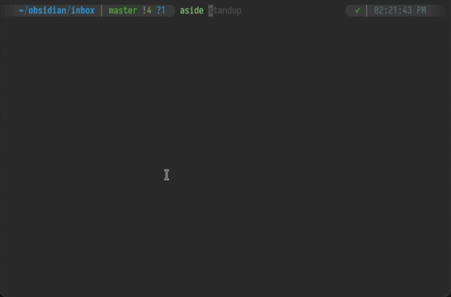

# aside

A meeting capture tool that lives inside your Obsidian vault. Record, take timestamped notes, transcribe locally, and distill into vault-connected artifacts — all without leaving the workflow you already have.



## Why this exists

There are good meeting tools out there. [Granola](https://granola.ai) enriches your notes with transcript context. [Hyprnote](https://github.com/fastrepl/hyprnote) is a fast, open-source Tauri app with local transcription and a plugin system. Both are polished products.

Aside is for people who don't want another app. If you already live in Obsidian and a terminal, aside slots into that workflow — no new window, no account, no integration to configure. It stores sessions inside your vault, transcribes locally, and uses a Claude Code skill to search your existing notes during distillation. The output is a vault note with `[[wikilinks]]`, not a document you have to move somewhere.

Born from two years of the same Obsidian workflow: record, take sparse notes, transcribe, manually stitch the two together, then hunt through old notes for connections. This automates all of it.

## What makes it different

**Vault-native.** Clone it into your Obsidian vault or point it at one. Sessions, recordings, and metadata live in `.aside/`. The distillation output is a vault note, not an export. No sync, no import step — it's already where your thinking lives.

**Your vault is the context window.** Every meeting app can transcribe. None of them know what you've been thinking about for the past two years. Aside's skill searches your vault during distillation — grepping for concrete anchors, running semantic search against your own writing — and weaves those connections into the final note. The meeting doesn't exist in isolation; it lands in the middle of your existing work.

**AI-native where it matters.** The intelligence isn't compiled into the app. The distillation step is a Claude Code skill — a plain markdown file ([`SKILL.md`](SKILL.md)) that teaches Claude how to use your vault as context. You can read it, edit it, swap the template. The skill orchestrates [Enzyme](https://github.com/jmpaz/enzyme) search, transcript analysis, and note generation in natural language. No black-box features, no plugin system to learn.

**5 MB binary, ~2,900 lines of code.** A Rust binary for capture, a Python script for transcription cleanup, and a markdown skill file for distillation. Small enough to read the entire codebase in an afternoon, fork it, and make it yours.

**Fully local.** Recording, transcription (whisper.cpp), and storage all happen on your machine. The only network call is the LLM for distillation, and that's through Claude Code — your existing setup, your API key.

## What it does

1. **Records** stereo audio (mic + system audio) while you type timestamped notes in a terminal editor
2. **Transcribes** locally via whisper.cpp with multi-pass cleanup (hallucination removal, dedup, filler stripping)
3. **Aligns** transcript and memo on a shared timeline
4. **Distills** into a structured vault note with connections to your existing notes via [Enzyme](https://github.com/jmpaz/enzyme)

## Install

```bash
# The recorder
cargo install --path .

# The transcriber
brew install whisper-cpp ffmpeg

# Download the whisper model (~1.5 GB, one-time)
hf download ggerganov/whisper.cpp ggml-large-v3-turbo.bin \
  --local-dir ~/.local/share/whisper-cpp/
```

macOS only. Requires screen recording permission for system audio capture.

## Usage

### Record

```bash
aside standup           # new session — opens TUI editor + starts recording
aside --resume standup  # resume an existing session
aside --list            # list all sessions
```

The TUI is a timestamped notepad. Each line gets a `[MM:SS]` timestamp when you start typing it. Edit a line later and it shows `[MM:SS ~MM:SS]`.

Keybindings: `Ctrl+D` switch mic, `Ctrl+S` save, `Ctrl+C` quit and save.

On quit, the memo is published to your Obsidian vault if `.aside/config.toml` is configured.

### Transcribe + distill

Use the `/aside` Claude Code skill for the full pipeline:

```
/aside standup              # transcribe → align → distill → vault note
/aside standup --align-only # just transcribe and align, no distillation
```

Or run transcription standalone:

```bash
python3 aside.py .aside/standup_seg0.wav --output .aside/
```

## Vault integration

Optional. Create `.aside/config.toml`:

```toml
[vault]
path = "~/obsidian"
folder = "inbox"
filename = "{{date:%Y-%m-%d-%-H-%M-%S}}"
open_in_obsidian = true
```

A template at `.aside/template.md` controls the note format. Variables: `{{name}}`, `{{memo}}`, `{{date:FORMAT}}`, `{{duration}}`.

## How it works

**Recording**: Rust binary captures mic audio via cpal and system audio via Core Audio tap, writing 48kHz stereo WAV. Switch mic devices mid-session with `Ctrl+D` — each switch creates a new audio segment with proper timeline offsets.

**Transcription**: `aside.py` splits stereo into mono channels, transcribes each with `whisper-cli`, then runs cleanup passes: hallucination removal, consecutive word dedup, backchannel/filler stripping, and gap-based phrase merging.

**Alignment**: The `/aside` skill interleaves transcript segments with memo lines on a shared millisecond timeline. Memo lines act as attention signals — they tell the distillation step what was worth writing down in the moment.

**Distillation**: The skill explores your vault via Enzyme — trending entities, semantic search, grep for concrete anchors — then drafts a structured note weighted by what your memo flagged. Connections you'd never search for manually show up as `[[wikilinks]]` in the final output.

## Project structure

```
aside.py            Transcription + cleanup pipeline (600 lines)
SKILL.md            Claude Code skill — the distillation brain (300 lines)
src/
  main.rs           CLI and session orchestration
  recorder.rs       Stereo audio capture (mic + system)
  app.rs            Timestamped editor state
  tui.rs            Terminal UI (ratatui)
  session.rs        Session metadata (JSON)
  publish.rs        Vault note creation on session end
  parser.rs         Markdown ↔ editor round-tripping
  text_helpers.rs   Word/char boundary helpers
```

Sessions are stored in `.aside/` as WAV segments + JSON metadata + markdown memo.
